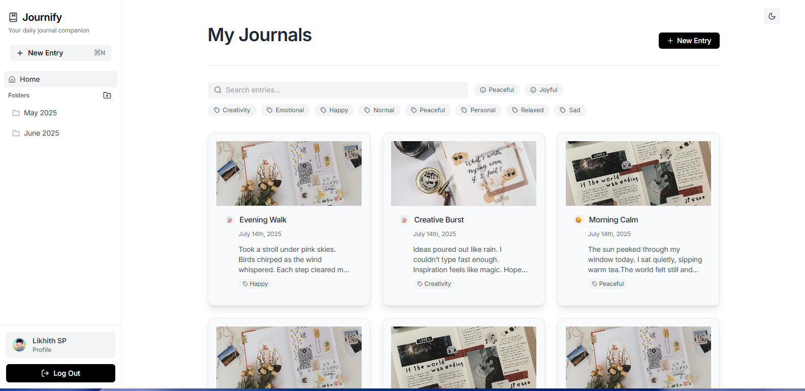

# Journify - Your Daily SaaS Journal Companion

<p align="center">
  
  
  <br />
  <b>Journify is an enterprise-grade, offline-first daily journaling web application designed to provide a distraction-free, aesthetically pleasing writing experience with Notion-style editing, multi-vector search, and robust security.</b><br>
  <a href="https://journifyx.vercel.app" target="_blank">Visit Live App</a>
</p>

---

## 🌟 What Makes Journify Exceptional

### 1. 🛡️ SaaS-Grade Authentication & Security
- **Multi-Provider OAuth**: One-click authentication with **Google** and **GitHub** using Supabase OAuth 2.0 PKCE.
- **Enterprise Password & Rate Limiting**: Client & endpoint brute-force protection with automatic lockouts after rapid failed attempts. Real-time password strength meter.
- **Email Verification & Password Reset**: Dedicated `/reset-password` recovery flow for self-serve token-based resets and signup activation screens.
- **Multi-Device & Session Governance**: Inspect active browser sessions and trigger a global **"Logout from all devices"** with a single click.
- **Row Level Security (RLS)**: Strict database-level isolation (`auth.uid() = user_id`) on all entries, folders, tags, media, and avatars.
- **GDPR Data Portability & Self-Deletion**:
  - One-click machine-readable JSON data export.
  - Two-step destructive account deletion with safety phrase confirmation (`DELETE`).
- **MIME & Storage Protection**: Strict image MIME-type sniffing (`image/jpeg`, `image/png`, `image/webp`, `image/gif`), 5MB/10MB file size caps, and collision-resistant path sanitization.
- **XSS Sanitization**: DOM-level HTML sanitization on all user-rendered rich content.
- **Truthful Cryptography**: Accurate transport (TLS 1.3) and database at-rest (AES-256) transparency with no deceptive E2EE claims.

---

### 2. ✍️ Notion + Day One Style Rich Editor
- **Complete Block Suite**:
  - **Headings**: H1, H2, H3 with refined typography.
  - **Formatting**: Bold, Italic, Color styling, and yellow text highlights.
  - **Lists**: Bullet lists, numbered lists, and interactive task checklists with checkboxes.
  - **Reflections**: Blockquotes and callouts.
  - **Code Blocks**: Formatted pre/code blocks.
  - **Tables**: Multi-row, multi-column interactive tables with header rows.
  - **Dividers**: Clean horizontal separator rules.
  - **Media & Attachments**: Image embeds and secure file uploads.
- **Slash Commands Palette (`/`)**: Type `/` anywhere on a blank or active line to open an autocomplete command palette for quick block insertion.
- **Zero-Friction Auto-Save Pipeline**:
  ```
  User types ➔ Local draft stored ➔ 600ms Debounce ➔ Sync to Supabase ➔ Mark "✓ Saved at HH:MM"
  ```
  No manual save button required. Live status transitions seamlessly from `Saving draft...` to `✓ Saved`.
- **Crash Recovery & Draft Restores**: Automatic detection of unsaved sessions after browser crashes with one-click restoration.
- **Timestamped Version History**: Review periodic snapshot revisions and restore prior checkpoints anytime.

---

### 3. ⚡ True Offline-First Architecture
```
                   Journify Application
                            │
               ┌────────────┴────────────┐
               │                         │
            Online                    Offline
               │                         │
            Supabase                  IndexedDB
       (Remote Database)         (Local Persistence)
               │                         │
               └────────────┬────────────┘
                            │
                       Sync Engine
              (FIFO Queue & Background Sync)
                            │
                   Conflict Resolution
                (Last-Write-Wins & Merging)
```
- **Local Persistence via IndexedDB**: Uses browser-native IndexedDB (`journify_offline_db`) for entries, folders, and operations.
- **Optimistic UI Updates**: Entries are created, updated, and deleted instantly with zero latency even with airplane mode active.
- **FIFO Sync & Retry Queue**: Operations are queued locally and automatically pushed to the cloud upon reconnecting. Drops poison queue items gracefully after 5 failed attempts.
- **Conflict Resolution**: Compares server `updated_at` timestamps using a Last-Write-Wins (LWW) resolution policy.
- **Service Worker & PWA Caching**: Caches core application assets (`/`, `/index.html`, `/journal.svg`) with a Stale-While-Revalidate strategy and background sync triggers.
- **Floating Connectivity Banner**: Live indicator displaying `Working Offline (IndexedDB Active)`, `Syncing N items...`, and a manual `Sync Now` trigger.

---

### 4. 🔍 Powerful Multi-Vector Global Search & Filters
- **Global Command Palette (`Cmd+K` / `Ctrl+K`)**: Instant modal accessible from anywhere across the app or via the persistent sidebar.
- **Multi-Vector Text Matching**: Evaluates queries simultaneously across:
  - **Title**
  - **Content** (full-text search across rich text body)
  - **Tags** (`#tag`)
  - **Moods** (`joyful`, `peaceful`, `sad`, `angry`, `anxious`)
  - **Formatted Dates** (e.g. searching *"September"*, *"Friday"*, *"2026"*)
- **Multi-Facet Power Filters**:
  - 📅 **Date Period**: `Any time`, `Today`, `Past 7 days`, `This month`, `This year`.
  - 😊 **Mood**: Filter by specific emotions.
  - 🏷️ **Tags**: Filter by individual workspace tags.
  - 📏 **Word Count**: `Short (< 100 words)`, `Medium (100–500 words)`, `Long (> 500 words)`.
  - 📎 **Attachments**: Filter entries that include photos or attachments.
  - ⭐ **Favorites Only**: Filter starred entries.
  - 🔒 **Private / Archived**: Filter entries marked private.
- **Instant Reset**: One-click "Reset all" to clear applied filter facets.

---

### 5. 🔔 Notification & Habit Reminder System
- **Daily Reflection Reminder**: Configurable daily reminder at your preferred time (default: `20:00`).
- **Custom Reminder**: Additional user-defined check-in for midday reflections or morning intentions.
- **Missed-Journal Nudge**: Automatically checks if you haven't written today by an evening cutoff hour (default: `21:00`):
  > *“You haven't written today. Want to take 5 minutes? ✨”*
- **Streak Celebration & Protection**: Milestone notifications celebrating 3, 7, 14, 30, 60, and 100-day streaks.
- **Notification Settings Panel**: Configurable in **Profile -> Notifications & Habits** with custom copy, time pickers, and a **"Send Test Notification"** feature.
- **Delivery Channels**: Native browser Web Notifications API + interactive in-app toast alerts with direct `"Write in journal ->"` buttons.

---

### 6. 📅 Interactive Calendar & Timeline (`/calendar`)
- **Monday-to-Sunday Month Grid (`M T W T F S S`)**: Accurate month matrix view with quick month switching and "Today" reset.
- **Rich Daily Metadata Indicators**:
  - **Entry Indicator**: Emerald dot and highlight if an entry exists on that day.
  - **Mood**: Direct emoji and calibrated mood pill preview (`😊 Joyful`, `😌 Peaceful`, `😔 Sad`, `😠 Angry`, `😰 Anxious`).
  - **Word Count**: Daily word count badges (e.g. `240w`).
  - **Streak Counter**: Consecutive writing streak calculation with animated flame counter (`🔥 N-day streak`).
  - **Tag Preview**: Direct tag preview chips on day tiles.
- **Click Date → Entry Drilldown**: Selecting any date displays that day's timeline stream with titles, excerpts, timestamps, and one-click navigation to view/edit or write.

---

### 7. 🎙️ Voice Journaling (Speech-to-Text Pipeline)
```
🎙 Record
     ↓
Speech-to-text
     ↓
Transcript
     ↓
Journal Entry
```
- **Live Recording & Audio Waveform**: Animated visualizer reacting to audio input with recording elapsed timer.
- **Continuous Speech-to-Text Engine**: Cross-browser Web Speech API (`SpeechRecognition` / `webkitSpeechRecognition`) with interim live streaming.
- **Live Transcript Window**: Real-time display of spoken words and running word count.
- **Smart Journal Extraction**: Automatically derives:
  - **Title**: Smartly extracts a concise title from the initial speech sentence.
  - **Paragraph Formatting**: Structures stream of thought into clean HTML paragraphs.
  - **Emotion / Mood Detection**: Detects mood keywords (`joyful`, `peaceful`, `sad`, `angry`, `anxious`).
  - **Smart Tagging**: Automatically tags topics like `#work`, `#ideas`, `#personal`, `#voice`.
- **Direct Entry Insertion**: Convert and push straight into the TipTap rich editor on [`/entry/new`](file:///c:/Users/Cutie/Documents/GitHub/Journify/src/pages/NewEntryPage.tsx), [`/entry/:id/edit`](file:///c:/Users/Cutie/Documents/GitHub/Journify/src/pages/EditEntryPage.tsx), or quick launch from [`Dashboard.tsx`](file:///c:/Users/Cutie/Documents/GitHub/Journify/src/pages/Dashboard.tsx).

---

## 🛠️ Tech Stack

- **Frontend**: React 19, TypeScript, Vite, TailwindCSS
- **Rich Editor**: TipTap v2 (Headings, Lists, Tables, Tasks, Blockquotes, Highlights, Links, Images, Code)
- **Offline & Storage**: IndexedDB (native), Service Worker PWA Cache, Supabase Storage
- **Backend & Auth**: Supabase (PostgreSQL with Row Level Security, Auth PKCE, RPC functions)
- **State & Sync**: React Context API, Custom Reactive Sync Engine
- **Animations & UX**: Framer Motion, Lucide Icons
- **Date Utilities**: date-fns

---

## 🚀 Getting Started

### Prerequisites
- Node.js 18+ and npm / yarn
- A Supabase project

### Installation

1. **Clone the repository**:
   ```bash
   git clone https://github.com/LikhithSP/Journify.git
   cd Journify
   ```

2. **Install dependencies**:
   ```bash
   npm install
   ```

3. **Configure Environment Variables**:
   Create a `.env` file in the root directory:
   ```env
   VITE_SUPABASE_URL=your_supabase_project_url
   VITE_SUPABASE_ANON_KEY=your_supabase_anon_key
   ```

4. **Apply Database Migrations**:
   Run the schema and security scripts in your Supabase SQL Editor:
   - `supabase/schema.sql` (initial schema)
   - `supabase/migrations/20260918_saas_security_hardening.sql` (Row Level Security & storage policies)

5. **Run Locally**:
   ```bash
   npm run dev
   ```
   Open [http://localhost:5173](http://localhost:5173) in your browser.

6. **Production Build**:
   ```bash
   npm run build
   ```

---

## 📁 Project Architecture

```
/src
  /components
    GlobalSearchModal.tsx       # Cmd+K global search & filter palette
    InAppNotificationToast.tsx  # In-app reminder toasts
    Layout.tsx                  # App shell, navigation & persistent sidebar
    NotionCard.tsx              # Grid & list entry cards
    OfflineSyncBanner.tsx       # Live connectivity & sync indicator
    SlashCommandMenu.tsx        # Notion-style '/' block insertion menu
    VersionHistoryModal.tsx     # Checkpoint rollback & draft recovery modal
  /contexts
    AuthContext.tsx             # SaaS authentication, sessions & lifecycle
    ThemeContext.tsx            # Light / dark mode switching
  /lib
    security.ts                 # Rate limiting, password evaluation, XSS & MIME guards
    supabase.ts                 # Supabase client setup
  /pages
    Dashboard.tsx               # Entry dashboard with inline search & tag filters
    EditEntryPage.tsx           # Auto-saving TipTap editor with crash recovery
    EntryPage.tsx               # Sanitized entry reader & actions
    FolderDashboard.tsx         # Categorized folder entry lists
    LoginPage.tsx               # OAuth & rate-limited authentication
    NewEntryPage.tsx            # Full Notion-style creation editor
    ProfilePage.tsx             # Profile, Security, Notifications & Data tabs
    RegisterPage.tsx            # Sign up with strength meter & verification
    ResetPasswordPage.tsx       # Token-based password recovery flow
  /services
    draftService.ts             # Local drafts, crash checkpoints & version history
    notificationService.ts      # Daily, custom, missed-journal & streak reminders
    offlineDB.ts                # IndexedDB persistence layer & sync queue
    syncEngine.ts               # Background synchronization & conflict resolution
  /types                        # TypeScript interfaces & definitions
/public
  sw.js                         # Service worker for offline shell & background sync
/supabase
  /migrations
    20260918_saas_security_hardening.sql # RLS & storage security policies
  schema.sql                    # Initial database tables
```

---

## 📄 License

This project is licensed under the MIT License - see the [LICENSE](LICENSE) file for details.
