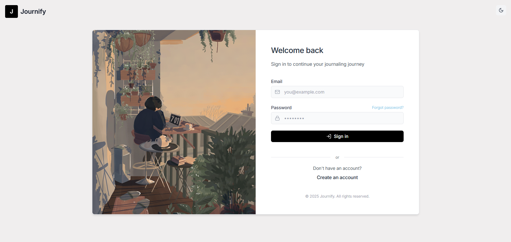

# Journify - Your Daily Journal Companion
<p align="center">
  
  <b>Journify is a modern, sleek daily journaling web app designed to provide a distraction-free, aesthetically pleasing journaling experience.</b><br><a href="https://journifyx.vercel.app" target="_blank">Visit Now</a> <br>

</p>


## Features

- ✨ **Modern UI** - Sleek, minimalist design with light/dark mode support
- 📝 **Rich Text Editor** - Format your entries with headings, lists, images, and more
- 🏷️ **Tags & Mood Tracking** - Categorize entries and track your mood over time
- 📅 **Timeline View** - Browse your entries in a beautiful timeline with filters
- 📊 **Analytics** - View insights and stats about your journaling habits
- 🔄 **Offline Support** - Write entries even without an internet connection
- 🔒 **Secure** - End-to-end encryption and privacy-focused design with Supabase
- ⚡ **High Performance** - Optimized loading and caching for fast journal viewing

## Recent Performance Improvements

We've significantly improved the journal entry loading performance:

- **Individual Entry Caching** - Entries are now cached individually for faster access
- **Single Entry Fetching** - When viewing a specific entry, we fetch only that entry instead of all entries
- **Optimized Data Storage** - More efficient deduplication and data management

To implement these improvements:

1. Replace `src/hooks/useOfflineSync.ts` with `src/hooks/useOfflineSync.fixed.ts`
2. Update the imports in your components from `useOfflineSync` to the fixed version
3. Update your components to utilize the new entryId parameter in the `fetchEntries` function

## Tech Stack

- **Frontend**: React, TypeScript, Vite, TailwindCSS
- **Backend**: Supabase (Authentication, Database, Storage)
- **Editor**: TipTap Rich Text Editor
- **State Management**: React Context API
- **Animations**: Framer Motion
- **Form Handling**: React Hook Form
- **Routing**: React Router v7
- **Date Handling**: date-fns
- **Icons**: Lucide React

## Getting Started

### Prerequisites

- Node.js 16+ and npm/yarn
- A Supabase account for the backend

### Installation

1. Clone the repository
```bash
git clone https://github.com/yourusername/journify.git
cd journify
```

2. Install dependencies
```bash
npm install
# or
yarn install
```

3. Create a Supabase project and get your API keys from the dashboard

4. Create a `.env.local` file in the project root:
```
VITE_SUPABASE_URL=your-supabase-url
VITE_SUPABASE_ANON_KEY=your-supabase-anon-key
```

5. Set up the database schema
   - Navigate to the SQL Editor in your Supabase dashboard
   - Copy the contents of `supabase/schema.sql` and run it

6. Start the development server
```bash
npm run dev
# or
yarn dev
```

7. Open your browser and navigate to `http://localhost:5173`

## Project Structure

```
/src
  /components      # Reusable UI components
  /contexts        # React context providers
  /hooks           # Custom React hooks
  /lib             # Library integrations (Supabase)
  /pages           # Main page components
  /types           # TypeScript type definitions
  /utils           # Helper functions
```

## Deployment

This app can be easily deployed to Vercel, Netlify, or any other static site host:

```bash
npm run build
# or
yarn build
```

## License

This project is licensed under the MIT License - see the LICENSE file for details
